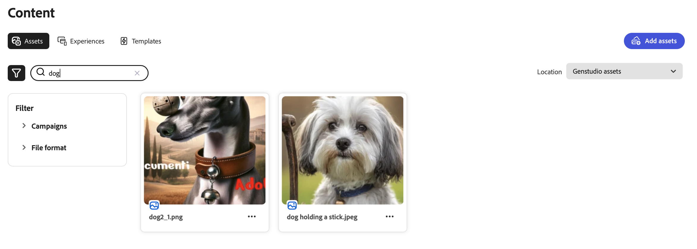

# Verwalten von Assets und Erlebnissen

Adobe GenStudio for Performance Marketing [!DNL Content] vereinfacht und verbessert die Verwaltung markengenehmigter Assets für die Verwendung und Wiederverwendung in Ihrer Digital Marketing-Journey.

## Assets-Galerie

Die Galerie [!UICONTROL Assets] enthält einen Inventar genehmigter Assets. Das Filtersymbol (Trichter) über der linken Seite der Tabelle öffnet das Menü **[!UICONTROL Filter]** , in dem Sie aus vielen Kategorien auswählen können, um die in der Galerie angezeigten Assets zu filtern. Klicken Sie auf das Suchsymbol (Lupe), um ein Asset mit einem Schlüsselwort zu suchen.

Im Folgenden finden Sie eine Suche nach dem Begriff `dog` in der Galerie [!UICONTROL Assets]:

### Assets-Speicherort

Standardmäßig werden Assets, die Sie [!DNL Content] über den [!DNL Create]-Prozess oder den Upload hinzufügen, im `GenStudio assets`-Repository gespeichert. Das Repository `GenStudio assets` ist ein Lese- und Schreibrepository in GenStudio for Performance Marketing. Dies bedeutet, dass Sie Assets im `GenStudio assets` -Repository speichern, bearbeiten und löschen können.

Die Liste **[!UICONTROL Position]** oberhalb der Galerie auf der rechten Seite ermöglicht es Ihnen, aus verbundenen Adobe Experience Manager (AEM) [!DNL Assets Content Hub] Repositorys auszuwählen. Wenn Sie ein AEM Repository auswählen, zeigt die Galerie einen Inventar der Assets aus diesem Repository an, sodass Sie genehmigte Assets aus diesen Repositorys als Eingaben für die Inhaltserstellung nutzen können. Die Filteroptionen ändern sich entsprechend den in [!DNL AEM Assets Content Hub] konfigurierten Kategorien.

Das AEM-Repository ist schreibgeschützt, d. h. Sie können Entwürfe, neue Assets oder Metadaten nicht im AEM Repository speichern. Alle Entwürfe und endgültigen Aktualisierungen für Assets, Erlebnisse und Vorlagen werden mit neuen [Systemmetadaten](asset-details.md#system-metadata) im `GenStudio assets`-Repository gespeichert.

Eine Anleitung zum Hinzufügen Ihres [!DNL AEM Assets Content Hub]-Repositorys zu GenStudio for Performance Marketing finden Sie unter [Verbinden eines AEM-Repositorys](connect-aem-repo.md) .

## Assets-Verwaltung

In [!UICONTROL Inhalt] können Performance Marketingexperten ihre digitalen Assets einfach speichern, abrufen und verwalten. Durch Nutzung des Repositorys `GenStudio assets` und AEM Repositorys können Benutzer sicherstellen, dass ihre Assets gut organisiert sind und für verschiedene Marketing-Kampagnen zugänglich sind. Dieser Ansatz für mehrere Repositorys bietet Flexibilität und Kontrolle über die Asset-Nutzung in allen Umgebungen, sodass sichergestellt ist, dass nur genehmigte und aktuelle Assets in Marketing-Maßnahmen verwendet werden.

### Hinzufügen von Assets

Beim Hinzufügen von Assets zu [!DNL Content] werden sie standardmäßig im `GenStudio assets`-Repository gespeichert. Die Schaltfläche _[!UICONTROL Assets hinzufügen]_ ist nur verfügbar, wenn der _[!UICONTROL Speicherort]_ das `GenStudio assets`-Repository ist.

{width="350" align="center"}

**So fügen Sie ein oder mehrere Assets hinzu**:

1. Klicken Sie in _[!DNL Content]_auf **[!UICONTROL Assets hinzufügen]**.

1. Legen Sie in der Ansicht _Asset hinzufügen_ eine oder mehrere Dateien in der Ablagefläche ab. Optional können Sie aus lokalen Dateien mit **[!UICONTROL Durchsuchen]** auswählen oder Dateien von Dropbox oder Microsoft OneDrive importieren.

1. Wählen Sie im Abschnitt _Details hinzufügen_ einen **[!UICONTROL Kampagnennamen]** oder geben Sie einen neuen Namen ein.

1. Fügen Sie optionale Details wie _Markenname_, _Personas_, _Region_ und _Schlüsselwörter_ im Abschnitt **Mehr Details** hinzu, um die Auffindbarkeit zu verbessern.

   Je mehr Details Sie bereitstellen, umso mehr erleben Sie die robusten Funktionen von GenStudio for Performance Marketing. Wählen Sie eine oder mehrere Details aus der Liste aus oder geben Sie ggf. eine neue ein, z. B. mit Suchbegriffen. Alle hinzugefügten Details werden unter der Liste angezeigt. Klicken Sie auf **`x`** , um ein Detail zu entfernen.

   Alle hinzugefügten Details gelten für alle Assets, die in dieser Aktion hinzugefügt werden.

   Siehe [Metadatendetails](/help/user-guide/content/asset-details.md#system-metadata).

1. Klicken Sie auf **[!UICONTROL Assets hinzufügen]**.

1. Klicken Sie nach Abschluss des Asset-Uploads auf **Fertig**.

1. Um Ihre neu hochgeladenen Assets anzuzeigen, klicken Sie in der Benachrichtigung _Neue verfügbare Assets_ unten auf der Arbeitsfläche auf **[!UICONTROL Aktualisieren]** .

<!-- 
In the future, need guidance on template upload errors. For now, the UI just says error.
-->

### Suchinhalt

Die Filter- und Suchschnittstelle ist schnell und responsiv und bietet ein produktives Erlebnis für die Suche. Jede [!DNL Content] -Ansicht bietet Filteroptionen, um Ihre Suche nach dem idealen Asset, Erlebnis oder der Vorlage einzuschränken. Für Assets und Erlebnisse können Sie eine Kampagne und spezifische Richtlinien auswählen, z. B. Inhalte, die für ein bestimmtes Produkt erstellt wurden.

Es gibt Filter, die auf [Keywords](asset-details.md#user-defined-metadata) und [Attributen](/help/user-guide/insights/attributes.md) basieren, um Suchergebnisse einzuschränken. Sie können beispielsweise ein Asset eines bestimmten Dateityps oder Betreffs suchen, um ein neues Erlebnis für Ihre Kampagne zu erstellen.

Bei der Suche nach _Erlebnissen_ können Sie den Filter **[!UICONTROL Erstellt von]** verwenden, um die Liste so zu beschränken, dass nur die von Ihnen oder einer bestimmten Person erstellten Erlebnisse angezeigt werden.

**So suchen Sie nach Inhalten, die wiederverwendet werden sollen**:

1. Wählen Sie in _[!DNL Content]_den Abschnitt **[!UICONTROL Assets]**aus.

1. Wählen Sie ein Asset-Repository aus der Liste **[!UICONTROL Speicherort]** aus oder überprüfen Sie, ob Sie das richtige Asset-Repository anzeigen. `GenStudio assets` ist das Standard-Repository.

   >[!IMPORTANT]
   >
   >Die Liste _Ort_ ist nur verfügbar, wenn Sie [eine Verbindung zu einem AEM-Repository herstellen](connect-aem-repo.md).

1. Klicken Sie auf **[!UICONTROL Suchen]** (Lupe), um einen Suchbegriff oder eine Beschreibung einzugeben.

1. Schränken Sie die Suche ein, indem Sie eine Kategorie aus der Liste _[!UICONTROL Filter]_ auswählen. Wenn Sie beispielsweise nach einer PNG-Datei suchen, klicken Sie auf **[!UICONTROL Dateiformat]** und wählen Sie **PNG**.

   Je stärker Sie Ihre Suche eingrenzen, desto weniger Filteroptionen sind verfügbar. Klicken Sie auf **[!UICONTROL Alle löschen]** , um alle Filter zu entfernen.

1. Wählen Sie ein Asset für eine vollständige Ansicht und eine Liste mit Details aus.

   Klicken Sie auf **[!UICONTROL Herunterladen]** (Pfeil nach unten), um das Asset auf Ihrer lokalen Workstation zu verwenden.
